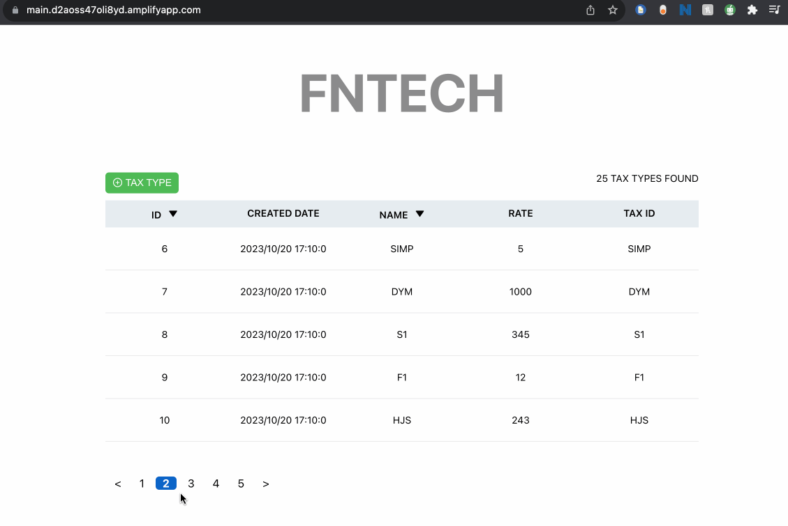
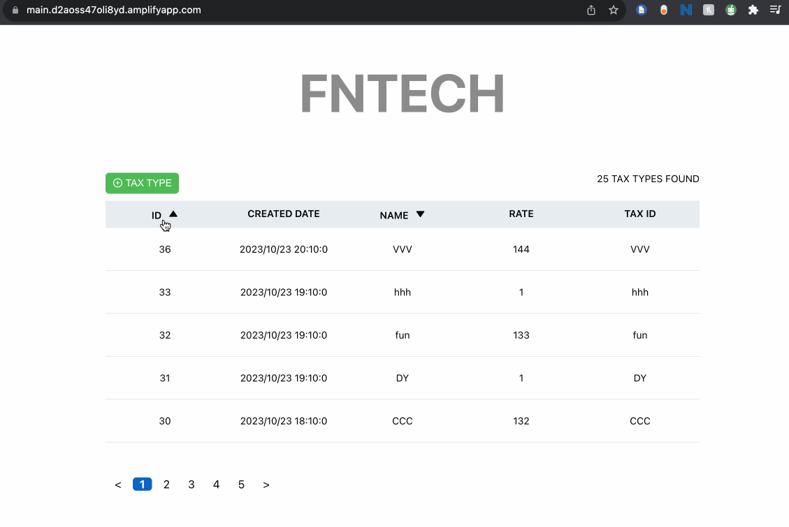
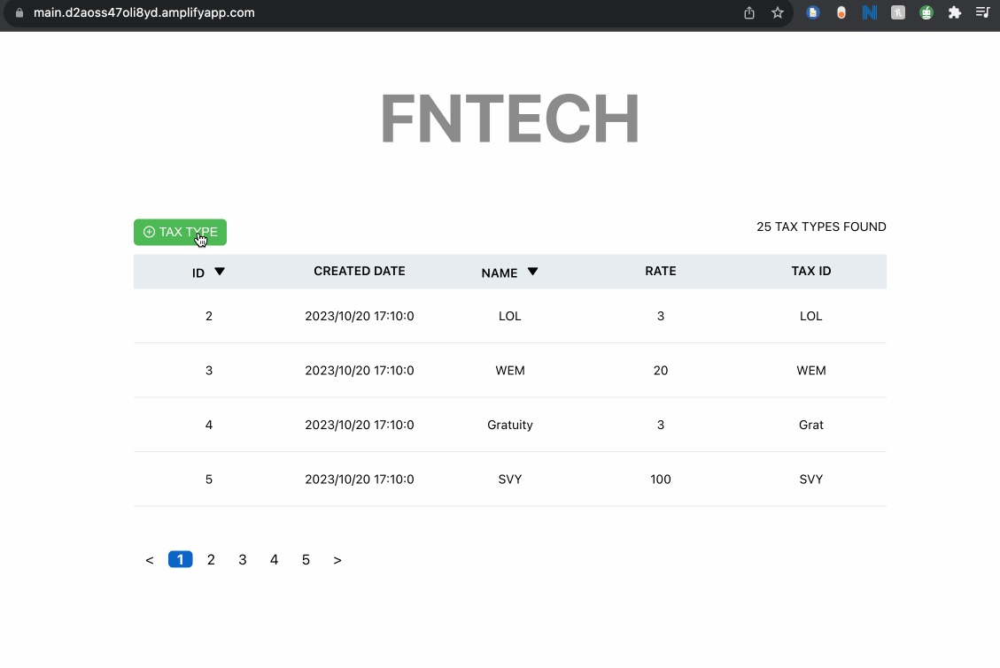
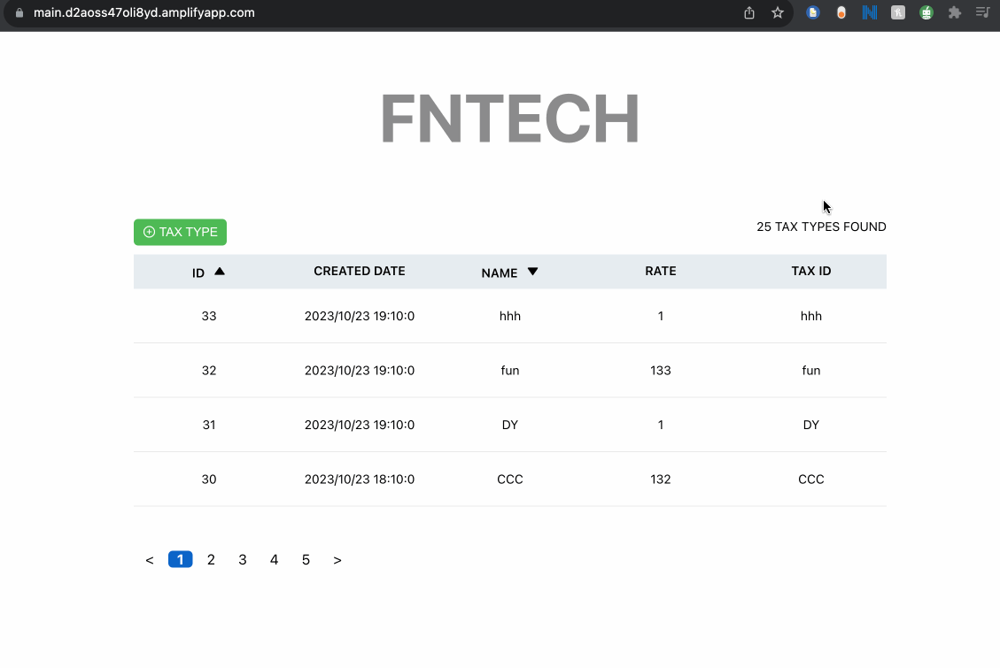
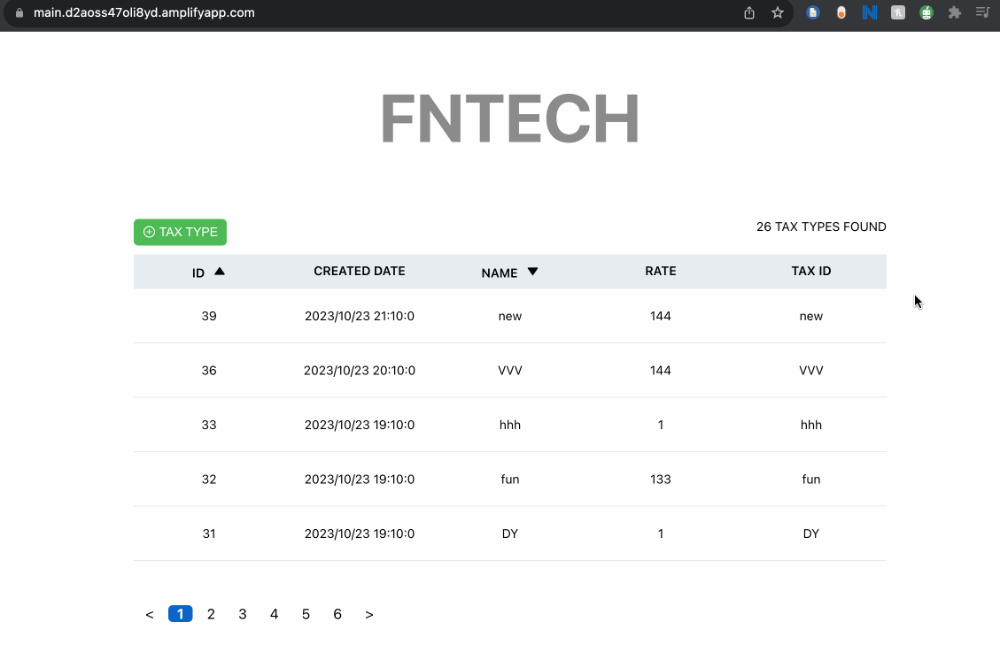

# FNTech Tax Types

This project displays a listed UI of tax types, with the requirements of pagination and making a name field sortable.

1. Run `npm install`
2. Run `npm run start`

This should be viewable on [http://localhost:3000](http://localhost:3000) to view it in your browser.

### Live demo

[https://main.d2aoss47oli8yd.amplifyapp.com/](https://main.d2aoss47oli8yd.amplifyapp.com/)

### Functionality Available
- Add a tax type (with validation)
- Edit a tax type (with validation)
- Delete a tax type
- Sort list by "ID"
- Sort list by "Name"
- Pagination

### To do's / Improvements
  - Deleting / editing doesn't quite change the items on browser without a refresh
  - Pagination isn't smooth with sorting
  - Form validation could be improved (serializing values)

### Demo Images

#### Pagination

#### Sorting

#### Add tax type

#### Edit tax type

#### Delete tax type

### `npm run test`

For testing suites.

